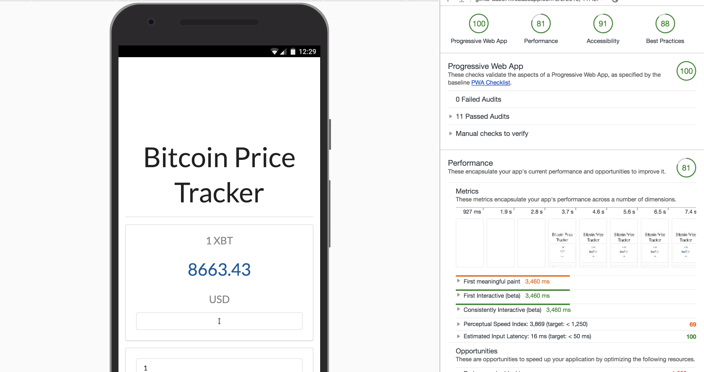

# Progresive Web App - Bitcoin Price Tracker

### Overview
Bitcoin Progresive Price Tracker is a simple realtime progresive web application built with React.js and semantic-ui (UI).
It hits [blockchain.info](https://blockchain.info/api/api_websocket) API & websocket end points.
See [Demo](https://glints-da5c7.firebaseapp.com/) here

### Installation

Install the dependencies and devDependencies and start the server.

```sh
$ git clone https://github.com/mrhandoko/pwa-bitcoin-price-tracker.git
$ cd pwa-bitcoin-price-tracker
$ yarn
$ yarn start
```

### Screenshot 100% Score Progresive Web App



### Run Progresive Web App Audit

```sh
1. Right click inspect on chrome
2. Select audits
3. Click Perform an audit
4. Click Run Audit
```
